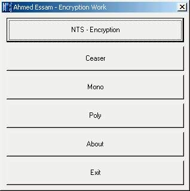



## NTS Encryption

### Description

Encryption

some old aglorithm has been done

poly , ceaser , NTS(Made by me) , mono , wait for more
 
### More Info
 
any file

video , audio , zip , text

any thing

Encrypted file

no one can hack your stuff

it's need some prof to make it out

             |
---                |---
**Submitted On**   |2003-07-12 00:38:00
**By**             |[Ahmed Essam Naiem](https://github.com/Planet-Source-Code/PSCIndex/blob/master/ByAuthor/ahmed-essam-naiem.md)
**Level**          |Advanced
**User Rating**    |5.0 (10 globes from 2 users)
**Compatibility**  |VB 4\.0 \(16\-bit\), VB 5\.0, VB 6\.0
**Category**       |[Encryption](https://github.com/Planet-Source-Code/PSCIndex/blob/master/ByCategory/encryption__1-48.md)
**World**          |[Visual Basic](https://github.com/Planet-Source-Code/PSCIndex/blob/master/ByWorld/visual-basic.md)
**Archive File**   |[NTS\_Encryp1794529162004\.zip](https://github.com/Planet-Source-Code/ahmed-essam-naiem-nts-encryption__1-56214/archive/master.zip)

